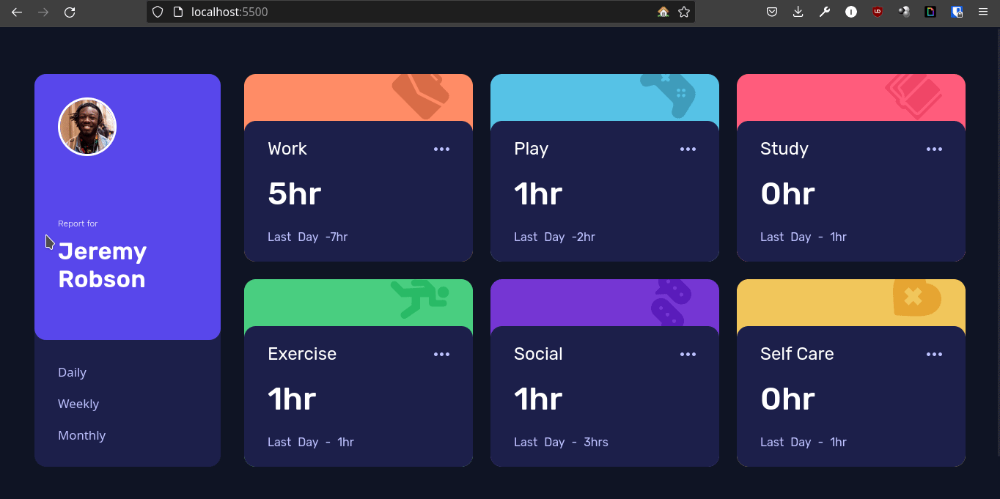

# Frontend Mentor - Time tracking dashboard solution

This is a solution to the [Time tracking dashboard challenge on Frontend Mentor](https://www.frontendmentor.io/challenges/time-tracking-dashboard-UIQ7167Jw). Frontend Mentor challenges help you improve your coding skills by building realistic projects. 

## Table of contents

- [Overview](#overview)
  - [The challenge](#the-challenge)
  - [Screenshot](#screenshot)
  - [Links](#links)
- [My process](#my-process)
  - [Built with](#built-with)
  - [What I learned](#what-i-learned)
  - [Continued development](#continued-development)
  - [Useful resources](#useful-resources)
- [Author](#author)
- [Acknowledgments](#acknowledgments)


## Overview

### The challenge

Users should be able to:

- View the optimal layout for the site depending on their device's screen size
- See hover states for all interactive elements on the page
- Switch between viewing Daily, Weekly, and Monthly stats

### Screenshot




### Links

- Solution URL: [Add solution URL here](https://your-solution-url.com)
- Live Site URL: [Add live site URL here](https://your-live-site-url.com)

## My process

### Built with

- Semantic HTML5 markup
- CSS custom properties
- Flexbox
- CSS Grid
- Mobile-first workflow

### What I learned

this challenge was a Great Learning Experience for me, I get more practice using grid, but the new things that I learned for the first time, was `<data>` semantic tag, and `@media` new syntax.

To see how you can add code snippets, see below:

```html
<ul class="card-data">
  <li>
     <data class="current-data" value="auto">5hr</data>
  </li>
</ul>
```
```css
@media (45rem <= width <= 59.99999rem) {
  
  .cards {
    grid-template-columns: repeat(2, 1fr);
    gap: 1.75rem;
  }
  
}

```

```js
function updateDisplayCurrent(n) {
  return n <= 1 && n < 2 ? `${n}hr` : `${n}hrs`;
}

function updateDisplayPrevious (n , s) {
return n <= 1 && n < 2 ? `last ${s} - ${n}hr` : `last ${s} - ${n}hrs`;
}
```


### Continued development

I don't plan to continue working on this project at this moment, but was a great challenge  
### Useful resources

- [Example resource 1](https://www.example.com) - This helped me for XYZ reason. I really liked this pattern and will use it going forward.
- [Example resource 2](https://www.example.com) - This is an amazing article which helped me finally understand XYZ. I'd recommend it to anyone still learning this concept.

## Author

- Website - [Add your name here](https://www.your-site.com)
- Frontend Mentor - [@yourusername](https://www.frontendmentor.io/profile/yourusername)
- Twitter - [@yourusername](https://www.twitter.com/yourusername)


## Acknowledgments

This is where you can give a hat tip to anyone who helped you out on this project. Perhaps you worked in a team or got some inspiration from someone else's solution. This is the perfect place to give them some credit.

